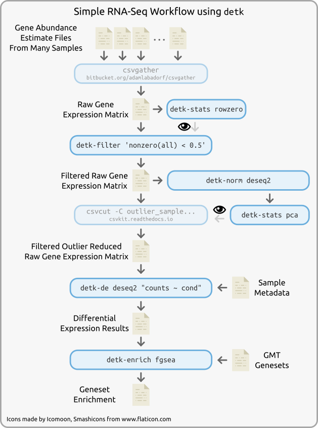

detk Quickstart
===============

``de_toolkit``, or ``detk``, is a python package and set of command line tools
that implements many common operations when working with counts matrices from
high throughput sequencing experiments. For example, the following diagram
illustrates various tools used in a simple RNA-Seq workflow downstream of
quantification:

This workflow performs the following, all without any custom code:

1. Takes the output from read counting (e.g. htseq-count_) or expression
   estimation software (e.g. salmon_ or kallisto_) and combines them into a
   concatenated counts matrix using the csvgather_ tool
2. Calculates statistics on the zero-ness of genes that is helpful in making
   decisions for filtering features using :doc:`detk-stats rowzero <stats>`
3. Filter out rows from the raw expression matrix that have half or more zero
   counts :doc:`detk-filter <filter>`
4. Normalizes the filtered counts matrix file using the DESeq2 normalization
   procedure :doc:`detk-norm deseq2 <norm>`
5. Computes and visualizes principal components on the normalized counts matrix
   to identify outlier samples :doc:`detk-stats pca <stats>`
6. Uses the ``csvcut`` tool from the csvkit_ software package to remove a
   hypothetical outlier sample from the raw matrix
7. Conducts differential expression using the DESeq2_ method by combining the
   raw counts matrix with a sample metadata file :doc:`detk-de deseq2 <de>`
8. Computes pre-ranked GSEA_ analysis on the differential expression statistics
   using the fgsea_ package

.. _htseq-count: https://htseq.readthedocs.io
.. _salmon: https://combine-lab.github.io/salmon/
.. _kallisto: https://pachterlab.github.io/kallisto/
.. _csvgather: https://bitbucket.org/adamlabadorf/csvgather/
.. _DESeq2: https://bioconductor.org/packages/release/bioc/html/DESeq2.html
.. _csvkit: https://csvkit.readthedocs.io
.. _GSEA: http://software.broadinstitute.org/gsea
.. _fgsea: http://bioconductor.org/packages/release/bioc/html/fgsea.html

These tools were designed by and for analysts who implement analyses like this
one regularly on the command line. The above workflow could be easily implemented with
common workflow management software like snakemake_ like so:

.. code-block:: python

    from glob import glob

    rule all:
        'detk_report/detk_report.html',
        'msigdb_c2cp_gsea_results.csv'

    rule gather_counts:
        input: glob('sample_*__salmon_counts/quant.sf')
        output: 'raw_counts.csv'
        shell:
            '''
            csvgather -j 0 -f NumReads -f "s:NumReads:{{dir}}:" \
                -f "s:__salmon_counts::" -o {output} \
                {input}
            '''

    rule raw_rowzero:
        input: 'raw_counts.csv'
        output: 'raw_counts_rowzero_stats.csv'
        shell:
            'detk-stats rowzero -o {output} {input}'

    rule filter_raw:
        input: 'raw_counts.csv'
        output: 'raw_counts_filtered.csv'
        shell:
            'detk-filter "nonzero(all) < 0.5" -o {output} {input}'

    rule deseq2_norm:
        input: 'raw_counts_filtered.csv'
        output: 'norm_counts_filtered.csv'
        shell:
            'detk-norm deseq2 -o {output} {input}'

    rule pca:
        input: 'norm_counts_filtered.csv'
        output: 'norm_counts_filtered_pca.csv'
        shell:
            'detk-stats pca -o {output} {input}'

    rule generate_detk_report:
        input:
            rules.raw_rowzero.output,
            rules.pca.output
        output: 'detk_report/detk_report.html'
        shell:
            'detk-report generate --dev'

    rule remove_outlier:
        input: 'raw_counts_filtered.csv'
        output: 'raw_counts_filtered_nooutlier.csv'
        shell:
            'csvcut -C outlier_sample_name {input} > {output}'

    rule de:
        input:
            counts='raw_counts_filtered_nooutlier.csv',
            covs='sample_info.csv'
        output: 'deseq2_results.csv'
        shell:
            'detk-de deseq2 -o {output} "counts ~ cond" {input.counts} {input.covs}'

    rule gsea:
        input:
            de='deseq2_results.csv',
            gmt='msigdb_c2cp.gmt'
        output: 'msigdb_c2cp_gsea_results.csv'
        shell:
            'detk-enrich fgsea -o {output} -i gene -c cond__log2FoldChange {input.gmt} {input.de}'

.. _snakemake: https://snakemake.readthedocs.io/en/stable/
